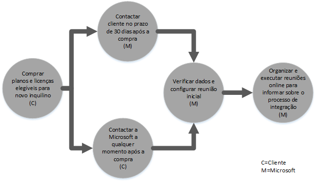
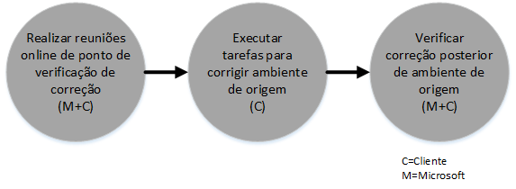
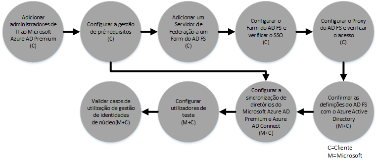

# Processo de Benef&#237;cio do FastTrack Center para o Azure Active Directory Premium 
Se a sua organização for elegível para o Benefício do FastTrack Center do Microsoft Azure AD Premium, pode trabalhar remotamente com especialistas da Microsoft para ter o seu ambiente do Microsoft Azure AD Premium pronto a utilizar. Para saber se a sua organização é elegível, consulte [Benefício do FastTrack Center para o Azure Active Directory Premium](../Topic/FastTrack_Center_Benefit_for_Azure_Active_Directory_Premium.md).

Este artigo fornece a seguinte informação:

-   [Overview of the onboarding process](#overview)

-   [Expectations for your source environment](#expectations_src_environ)

-   [Phases of the onboarding process](#phases_onboarding_process)

-   [Microsoft responsibilities](#microsoft_responsibilities) para cada fase

-   [Your responsibilities](#your_responsibilities) para cada fase

O que pode esperar quando a integração for concluída:

-   O inquilino do Microsoft Azure AD Premium é criado.

-   Os utilizadores licenciados podem aceder a serviços do Microsoft  Azure AD Premium ao utilizar uma das seguintes opções de identidade:

    -   Identidades de Nuvem (contas exclusivas do Microsoft Azure AD Premium).

    -   Identidades Sincronizadas: Contas do Microsoft Azure AD Premium sincronizadas a partir do Active Directory no local com a ferramenta Azure Active Directory Connect (Azure AD Connect) para clientes com uma única floresta ou várias florestas do Active Directory.

    -   Identidades Federadas – com contas do Microsoft Azure AD Premium que são:

        -   Sincronizadas a partir do Active Directory com a ferramenta Microsoft Azure AD Connect para clientes com uma configuração de floresta única do Active Directory.

        -   Federadas com Serviços de Federação do Active Directory (AD FS) 2.0 ou posterior a partir do seu Active Directory no local.

## Descrição geral do processo de integração
A Integração tem dois componentes principais:

-   **Funções essenciais** - tarefas necessárias para a configuração de inquilinos e integração com o Azure AD, se necessário. As capacidades de núcleo também fornecem a base para a integração de outros serviços elegíveis Microsoft Online.

-   **Integração de serviço** - tarefas necessárias para configurar o Microsoft Azure AD Premium autónomo ou com sincronização de diretórios do Azure AD Connect ou AD FS.

O diagrama a seguir descreve a linha cronológica para utilizar o benefício do FastTrack Center.

O processo básico é o seguinte:

-   A Microsoft irá tentar contactá-lo no prazo de 30 dias a contar da data em que adquirir um plano elegível. Também pode solicitar assistência a partir do [FastTrack Center](http://fasttrack.microsoft.com/) se estiver pronto para implementar estes serviços na sua organização. Para pedir assistência, inicie sessão no FastTrack Center (http://fasttrack.microsoft.com), aceda ao dashboard, selecione o nome da sua empresa, clique no separador Ofertas e clique no botão de pedido de assistência para o serviço elegível. Uma vez iniciado o suporte de integração, iremos definir um agendamento de reuniões online.

-   A equipa da Microsoft irá ajudá-lo com as funções essenciais e, em seguida, irá ajudá-lo a integrar uma vez cada serviço elegível.

Qualquer suporte de integração será fornecido remotamente pela equipa da Microsoft atribuída:

-   A Microsoft irá fornecer-lhe assistência remota nas diversas atividades de integração através de ferramentas, documentação e orientação. Se pretender que a Microsoft execute determinadas tarefas de configuração por si, pode optar por conceder à Microsoft as devidas permissões e acesso para realizar essas tarefas.

-   O suporte de integração é fornecido pelo Centro de FastTrack e está disponível durante o horário comercial normal para uma determinada região.

-   O suporte de integração está disponível em chinês tradicional, inglês, francês, alemão, italiano, japonês, português (Brasil) ou espanhol.

-   A equipa da Microsoft pode trabalhar diretamente consigo ou com o seu representante.

## Expetativas para o seu ambiente de origem
Pode já ter o Microsoft Active Directory local no ambiente de origem que pretende integrar com o Microsoft Azure AD Premium para tirar partido da gestão de identidades avançada a partir de uma única consola. O benefício do FastTrack Center inclui ajudá-lo a integrar o Microsoft Azure AD Premium com a implementação local existente. Se a integração for necessária, o seu ambiente de origem tem de estar num nível mínimo para essa aplicação.

A tabela a seguir mostra o que é esperado no seu ambiente de origem para a integração.

|Atividade|Expetativa de ambiente de origem|
|-------------|------------------------------------|
|Funções essenciais|Florestas do Active Directory com o nível funcional de floresta definido para o Windows Server 2008 ou superior, com a seguinte configuração de floresta:  -   Floresta única do Active Directory -   Várias florestas do Active Directory **Note:** Para todas as configurações com várias florestas, a implementação do AD FS está fora do âmbito para o Benefício do FastTrack Center.|
|Integração de serviço  -   Microsoft Azure AD Premium|O Active Directory no local e o ambiente foram preparados para o Azure AD Premium, que inclui a correção de problemas identificados que impedem a integração com as funcionalidades do Azure AD e do Azure AD Premium.|

## Fases do processo de integração
A integração do Microsoft Azure AD Premium tem cinco fases principais, conforme apresentado na figura seguinte:

-   Iniciar

-   Avaliar

-   Corrigir

-   Ativar

-   Fechar

Para as tarefas detalhadas de cada fase, consulte as secções [Microsoft responsibilities](#microsoft_responsibilities) e [Your responsibilities](#your_responsibilities).

### Fase de iniciação
Depois de adquirir o número apropriado de licenças, siga as orientações no e-mail de confirmação da compra para associar as licenças ao inquilino existente ou novo inquilino. A Microsoft irá verificar a sua elegibilidade para o Benefício do FastTrack Center. A Microsoft irá tentar contactá-lo no prazo de 30 dias a contar da data em que adquirir um plano elegível. Também pode solicitar assistência a partir do [FastTrack Center](http://fasttrack.microsoft.com/) se estiver pronto para implementar estes serviços na sua organização. Para pedir assistência, inicie sessão no FastTrack Center (http://fasttrack.microsoft.com), aceda ao dashboard, selecione o nome da sua empresa, clique no separador Ofertas e clique no botão de pedido de assistência para o serviço elegível. Uma vez iniciado o suporte de integração, iremos definir um agendamento de reuniões online.

Durante esta fase, falaremos do processo de integração, verificaremos dados e convocaremos uma reunião inicial.

### Fase de avaliação
Depois de iniciar o processo de integração, a Microsoft irá trabalhará consigo para avaliar o seu ambiente de origem e os requisitos. Serão executadas ferramentas para avaliar o seu ambiente e a Microsoft irá orientá-lo através da avaliação do Active Directory no local, dos navegadores de Internet, sistemas operativos de dispositivos cliente, DNS, rede, infraestrutura e sistema de identidade para determinar se são necessárias alterações para a integração. Com base na sua configuração atual, iremos fornecer um plano de correção que colocará o seu ambiente de origem de acordo com os requisitos mínimos para uma integração com êxito para o Microsoft Azure AD Premium. Também definiremos chamadas de verificação apropriadas para a fase de correção.

### Fase de correção
Se necessário, executará as tarefas do plano de correção no ambiente de origem de modo a corresponder aos requisitos de integração de cada serviço.

Antes de iniciar a fase de Ativação, verificaremos em conjunto os resultados das atividades de correção para nos certificarmos de que está pronto para continuar.

### Fase de ativação
Quando todas as atividades de correção estiverem concluídas, o projeto prossegue para a configuração da infraestrutura básica para o consumo do serviço e aprovisionamento do Microsoft Azure AD Premium.

**Fase de ativação - funções essenciais**

A ativação de funções essenciais envolve o aprovisionamento de serviço e inquilino e a integração de identidade. Também inclui passos para fornecer uma base para a integração do Microsoft Azure AD Premium.

A Integração do Microsoft Azure AD Premium pode começar quando a integração do núcleo for concluída.

**Fase de ativação – Microsoft Azure AD Premium**

O ambiente do Microsoft Azure AD Premium pode ser configurado com a sincronização de diretórios do Azure AD Connect e os Serviços de Federação do Active Directory (AD FS), conforme necessário.

Para cenários do Microsoft Azure AD Premium que incluem a sincronização de identidades no local para a nuvem, iremos ajudá-lo a adicionar os administradores de TI e os utilizadores à sua subscrição, a configurar pré-requisitos de gestão, a configurar o Microsoft Azure AD Premium, a configurar a sincronização de diretórios através do Azure AD Connect e os Serviços de Federação do Active Directory através do Azure AD Connect, a configurar utilizadores de teste e a validar os casos de utilização do núcleo para o serviço.

A configuração do Microsoft Azure AD Premium inclui ativar as seguintes funcionalidades:

-   Reposição de Palavra-passe Self-Service (SSPR)

-   Azure Multi-factor Authentication (MFA)

-   Aplicação de Software como um Serviço (SaaS) – configurar uma aplicação SaaS

-   Gestão de Grupos Self-Service (SSGM)

-   Relatórios administrativos

## Responsabilidades da Microsoft

### Geral

-   Fornecer assistência remota de suporte para as atividades de configuração necessárias, conforme detalhado nas descrições das fases.

-   Fornecer documentação e ferramentas de software disponíveis, consolas de administração e scripts para ajudá-lo a reduzir ou eliminar tarefas de configuração.

Não é necessário conceder acesso e permissões à Microsoft para utilizar o benefício do FastTrack Center. Nalguns casos, pode optar por conceder acesso e permissões adequadas à Microsoft para efetuar determinadas atividades em seu nome.

### Fase de iniciação

-   Contactá-lo no prazo de 30 dias após a compra de licenças elegíveis para um novo inquilino.

-   Trabalhar consigo para iniciar a integração no prazo de 90 dias após a compra de licenças elegíveis.

-   Definir os serviços que pretende integrar.

### Fase de avaliação

-   Fornecer uma descrição geral administrativa.

-   Fornecer orientações sobre:

    -   Necessidades de DNS, rede e infraestrutura.

    -   Necessidades do cliente (navegador de Internet, sistema operativo cliente e necessidades de serviços).

    -   Identidade de utilizador e aprovisionamento.

    -   Identificação dos requisitos de Sincronização de Diretórios.

    -   Determinar se a sincronização de hash de palavra-passe satisfaz os objetivos do cliente ou se é necessário o AD FS.

    -   Ativação de serviços elegíveis que tenham sido adquiridos e definidos como parte da integração.

    -   Identificar requisitos de ambiente de pilotagem e teste necessários, por exemplo, contas de teste, instância de teste de aplicação SaaS (por exemplo, SalesForce).

-   Estabelecimento da linha de tempo das atividades de correção.

-   Fornecimento de uma lista de verificação de correção.

### Fase de correção

-   Realizar chamadas de conferências consigo, de acordo com o agendamento acordado, para analisar o progresso das atividades de correção.

-   Auxiliar na execução de ferramentas para identificar e resolver problemas e na interpretação dos resultados.

### Fase de ativação
Fornecer orientação sobre:

-   Ativar o seu inquilino do Microsoft Azure AD Premium.

-   Configurar as portas da firewall.

-   Configurar o DNS para serviços elegíveis.

-   Validar a conectividade dos serviços do Microsoft Azure AD Premium.

-   Para um ambiente de floresta única:

    -   Instalar uma sincronização de diretórios entre os Serviços de Domínio do Active Directory (AD DS) e o Azure AD Connect, se necessário.

    -   Configurar a sincronização de palavra-passe com a ferramenta Azure AD Connect.

-   Para um ambiente de várias florestas:

    -   Instalar a sincronização do Azure AD Connect, configurar para vários cenários de floresta. Tenha em atenção que a sincronização de hash de palavra-passe e a repetição de escrita de palavras-passe suportam várias florestas.  No entanto, não são suportados outros cenários de repetição de escrita.

    -   Configurar a sincronização entre florestas do Active Directory no local e o diretório do Microsoft Azure AD Premium (Azure Active Directory).

        > [!NOTE]
        > O desenvolvimento e implementação para extensões de regras personalizadas estão fora de âmbito.

-   Para uma única floresta quando o destino são identidades federadas: Instalar e configurar os Serviços de Federação do Active Directory (AD FS) para a autenticação de domínio local com o Microsoft Azure AD Premium numa configuração de site único, com tolerância a falhas, se necessário.

    > [!NOTE]
    > Para todas as configurações com várias florestas, as implementações do AD FS estão fora do âmbito.

-   Testar a funcionalidade de início de sessão único (SSO), se implementada.

#### Fase de ativação - Azure AD Premium – com o Azure AD Connect e o AD FS
Fornecer orientações sobre a configuração:

-   Aprovisionamento de utilizadores, incluindo licenciamento.

-   Sincronização de diretórios do Azure AD Connect (com repetição de escrita de palavras-passe e sincronização de hash de palavra-passe).

-   Serviços de Federação do Active Directory (AD FS).

-   Reposição de Palavra-passe Self-Service (SSPR).

-   Azure Multi-factor Authentication (MFA).

-   Uma aplicação integrada, que pode incluir o Início de Sessão Único para aplicações SaaS.

-   Relatórios de utilização e de segurança para administradores.

-   Gestão de Grupos Self-Service (SSGM).

-   Proxy da aplicação.

-   Notificações de administrador.

-   Ecrã de início de sessão personalizado, incluindo o logótipo, o texto e as imagens.

## As suas responsabilidades
Esta secção descreve algumas das suas responsabilidades durante o processo de integração.

### Geral

-   Quaisquer melhorias e integrações no seu inquilino do Microsoft Azure AD Premium para além das opções configuráveis apresentadas neste artigo.

-   Programa geral e gestão do projeto dos seus recursos.

-   Comunicações de utilizador final, documentação, formação e gestão de alterações.

-   Documentação de suporte técnico e formação.

-   Produzir quaisquer relatórios, apresentações ou atas de reunião específicas da sua organização.

-   Criar documentação arquitetural e técnica específica da sua organização.

-   Criação, aquisição, instalação e configuração de hardware e de rede.

-   Aquisição, instalação e configuração do software.

-   Gerir, configurar e aplicar políticas de segurança para além das que foram criadas para testar a configuração e funcionalidade de base dos serviços do Microsoft Azure AD Premium.

-   Inscrever contas de utilizador para além das que foram utilizadas para testar a configuração e funcionalidade de base dos serviços do Microsoft Azure AD Premium.

-   Configuração de rede, análise, validação de largura de banda, teste e monitorização.

-   Gestão de um processo de aprovação de gestão de alteração técnica e criação de documentação de suporte.

-   Modificação do modelo operacional e dos guias de operações.

-   Configurar a autenticação multifator no local.

-   Desativar e remover ambientes de origem e serviços anteriormente utilizados pelo cliente.

-   Criação e manutenção do seu ambiente de teste.

-   Instalação de service packs e outras atualizações necessárias em servidores de infraestrutura.

-   Fornecer e configurar todos os certificados SSL públicos.

-   Elaboração da declaração dos Termos de Utilização (TOU) da organização a ser configurada e apresentada nos dispositivos dos utilizadores finais.

### Fase de iniciação

-   Trabalhar com a equipa da Microsoft para começar a integração dos serviços elegíveis.

-   Participar na reunião inicial do contrato, gerir e liderar os participantes da sua organização e confirmar as linhas de tempo de correção.

### Fase de avaliação

-   Identificar intervenientes apropriados (inclusive um gestor de projeto) para concluir as atividades de avaliação necessárias.

-   Caso pretenda, partilhe o seu ecrã com a Microsoft se necessitar de orientação na execução de ferramentas de avaliação no seu ambiente ou na sua subscrição do Microsoft Azure AD Premium.

-   Participar nas reuniões para criar a lista de verificação das correções e para contribuir para o plano geral, incluindo a infraestrutura, rede, administração, preparação da sincronização de diretório, segurança de rede e tópicos de identidade federada.

-   Participar nas reuniões para delinear a abordagem de aprovisionamento de utilizador.

-   Participar nas reuniões de planeamento da configuração do serviço online.

-   Criar um plano de suporte para a preparação da migração.

### Fase de correção

-   Executar os passos necessários para concluir as atividades de correção identificadas na fase de Avaliação.

-   Participar nas reuniões de ponto de verificação.

### Fase de ativação

-   Caso pretenda, partilhar o seu ecrã com a Microsoft se necessitar de orientação na realização de alterações no seu ambiente ou na sua subscrição do Microsoft Azure AD Premium.

-   Gerir os recursos conforme apropriado.

-   Configurar itens relacionados com a rede com orientação da Microsoft.

-   Realizar a preparação do diretório e configurar a sincronização de diretório com orientação da Microsoft.

-   Configurar a infraestrutura relacionada com a segurança (por exemplo, portas de firewall) com orientação da Microsoft.

-   Implementar a infraestrutura de cliente apropriada.

-   Implementar uma abordagem de aprovisionamento de utilizador com orientação da Microsoft.

-   Ativar vários serviços com orientação da Microsoft.

## Pretende obter mais informações?
Consulte [Microsoft Azure Active Directory](http://azure.microsoft.com/en-us/documentation/services/active-directory/) e [Enterprise Mobility Suite](http://www.microsoft.com/en-us/server-cloud/products/enterprise-mobility-suite/default.aspx).

