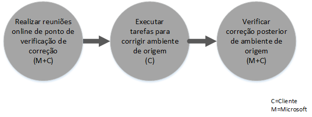

# Processo de Benef&#237;cio do FastTrack Center para o Intune
Se a sua organização for elegível para o benefício do serviço do Microsoft Intune, pode trabalhar remotamente com especialistas da Microsoft para o ambiente Microsoft Intune ficar pronto a utilizar.

O Microsoft Intune é a parte do Microsoft Enterprise Mobility Suite (EMS) que fornece as funcionalidades do Gestão de Mobilidade da Empresa (EMM), incluindo a Gestão de Dispositivos Móveis (MDM) e a Gestão de Aplicações Móveis (MAM).  Pode utilizar o Microsoft Intune para permitir que os seus funcionários sejam produtivos em dispositivos móveis com o aprovisionamento e configuração de dispositivos e com a implementação de aplicações móveis.  Além disso, pode utilizar o Microsoft Intune para ajudar a proteger os seus dados da empresa, monitorizando a conformidade do dispositivo, protegendo as aplicações móveis e os dados e efetuando a integração com o Azure AD para controlar o acesso aos serviços da empresa.

Para saber se a sua organização é elegível, consulte [Benefício do FastTrack Center para o Intune](../Topic/FastTrack_Center_Benefit_for_Intune.md). Se estiver interessado em preparar o seu ambiente para outros serviços do Enterprise Mobility Suite, consulte o artigo [Benefício do FastTrack Center para o Enterprise Mobility Suite](../Topic/FastTrack_Center_Benefit_for_Enterprise_Mobility_Suite.md).

**Está à procura de informações sobre o Microsoft FastTrack para o Office 365? Consulte o** [Benefício do FastTrack Center para Office 365](https://technet.microsoft.com/library/office-365-onboarding-benefit.aspx).

Este artigo apresenta as seguintes informações sobre o benefício do serviço para o Microsoft Intune:

-   [Overview of the onboarding process](#overview_onboarding_process)

-   [Expectations for your source environment](#expectations_src_environ)

-   [Phases of the onboarding process](#phases_onboarding_process)

-   [Microsoft responsibilities](#microsoft_responsibilities) para cada fase

-   [Your responsibilities](#your_responsibilities) para cada fase

O que pode esperar quando a integração for concluída:

-   O inquilino do Serviço Online da Microsoft é criado.

-   Os utilizadores licenciados podem aceder ao serviço Microsoft Intune utilizando uma das seguintes opções de identidade:

    -   Identidades de Nuvem (contas exclusivas do serviço online da Microsoft).

    -   Identidades Sincronizadas: as contas do Microsoft Intune sincronizadas a partir do seu Active Directory no local com o Azure Active Directory Connect (Serviços de sincronização):

        -   Para clientes com um ambiente de floresta única do Active Directory.

        -   Para clientes com topologia do Active Directory de várias florestas suportada.

-   Identidades Federadas – contas do Microsoft Intune:

    -   Sincronizadas a partir do Active Directory com a ferramenta Microsoft Azure Active Directory Connect para clientes com uma configuração de floresta única do Active Directory ou para clientes com uma floresta única de contas do Active Directory (também conhecida como "floresta de início de sessão") e uma configuração de floresta única de recurso do Active Directory.

    -   Federadas com a função dos Serviços de Federação do Active Directory do Windows Server 2012 R2, a partir do Active Directory no local ou federadas com os Serviços de Federação do Active Directory (AD FS) 2.0 ou posterior a partir do seu Active Directory no local.

## Descrição geral do processo de integração
A Integração tem dois componentes principais:

-   **Funções essenciais** - tarefas necessárias para a configuração de inquilinos e integração com o Azure AD, se necessário. A componente de funções essenciais também fornece a base para a integração de outros serviços elegíveis.

-   **Integração de serviço** - tarefas necessárias para configurar o Microsoft Intune.

O diagrama a seguir descreve a sequência de eventos para utilizar o Benefício do FastTrack Center.

O processo básico é o seguinte:

-   O FastTrack Center irá tentar contactá-lo no prazo de 30 dias a contar da data em que adquirir um plano elegível. Também pode solicitar assistência a partir do [FastTrack Center](http://fasttrack.microsoft.com/) se estiver pronto para implementar estes serviços na sua organização. Para pedir assistência, inicie sessão no [FastTrack Center](http://fasttrack.microsoft.com/), aceda ao dashboard, selecione o nome da sua empresa, clique no separador Ofertas e clique no botão de Pedido de Assistência para pedir assistência para o Microsoft Intune, o Azure Active Directory Premium ou o Azure Rights Management Premium.

-   O FastTrack Center irá ajudá-lo com as funções essenciais e, em seguida, irá ajudá-lo a integrar uma vez cada serviço elegível.

Qualquer suporte de integração será fornecido remotamente pela equipa da Microsoft atribuída:

-   A Microsoft irá fornecer-lhe assistência remota nas diversas atividades de integração através de ferramentas, documentação e orientação.

-   O suporte de integração é fornecido pelo Centro de FastTrack e está disponível durante o horário comercial normal para uma determinada região.

-   O suporte de integração está disponível em chinês tradicional, inglês, francês, alemão, italiano, japonês, português (Brasil) ou espanhol.

-   A equipa da Microsoft pode trabalhar diretamente consigo ou com o seu representante.

## Expetativas para o seu ambiente de origem
Pode já ter serviços no ambiente de origem que pretende mover para o serviço Microsoft Intune ou integrar com este. Para alguns serviços, o Benefício do FastTrack Center para o Intune inclui ajuda na configuração de algum nível de integração com o ambiente de origem. Se a integração for necessária, o seu ambiente de origem tem de estar num nível mínimo para essa aplicação.

A tabela a seguir mostra o que é esperado no seu ambiente de origem para a integração.

|Atividade|Expetativa de ambiente de origem|
|-------------|------------------------------------|
|Funções essenciais|Florestas do Active Directory com o nível funcional de floresta definido para o Windows Server 2008 ou superior, com a seguinte configuração de floresta:  -   Floresta única do Active Directory -   Várias florestas do Active Directory **Note:** Para todas as configurações com várias florestas, a implementação do AD FS está fora do âmbito para o Benefício do FastTrack Center.|
|Integração de serviço  -   Microsoft Intune -   Microsoft Intune integrado com o System Center Configuration Manager|Para a gestão de dispositivos com o System Center Configuration Manager 2012 R2 ou versão posterior ligado ao Microsoft Intune, os administradores de TI terão de seguir a [Lista de Verificação do Administrador: Configurar o Configuration Manager para Gerir Dispositivos Móveis Através do Microsoft Intune](https://technet.microsoft.com/library/jj943763.aspx). **Note:** O benefício do serviço não inclui assistência para configurar ou atualizar o System Center Configuration Manager de acordo com os requisitos mínimos necessários para o Microsoft Intune integrado com o System Center Configuration Manager.|

## Fases do processo de integração
A integração tem quatro fases principais:

-   Iniciar

-   Avaliar

-   Corrigir

-   Ativar

Para as tarefas detalhadas de cada fase, consulte as secções [Microsoft responsibilities](#microsoft_responsibilities) e [Your responsibilities](#your_responsibilities).

### Fase de iniciação
Depois de adquirir o número e tipo apropriados de licenças, siga as orientações no e-mail de confirmação da compra para associar as licenças ao inquilino existente ou novo inquilino. O FastTrack Center irá verificar a sua elegibilidade para o benefício do serviço. A Microsoft irá tentar contactá-lo no prazo de 30 dias a contar da data em que adquirir um plano elegível. Também pode solicitar assistência a partir do [FastTrack Center](http://fasttrack.microsoft.com/) se estiver pronto para implementar estes serviços na sua organização. Para pedir assistência, inicie sessão no [FastTrack Center](http://fasttrack.microsoft.com/), aceda ao dashboard, selecione o nome da sua empresa, clique no separador Ofertas e clique no botão de Pedido de Assistência para pedir assistência para o Microsoft Intune, o Azure Active Directory Premium ou o Azure Rights Management Premium.

Durante esta fase, falaremos do processo de integração, verificaremos dados e convocaremos uma reunião inicial.

### Fase de avaliação
Depois de iniciar o processo de integração, a Microsoft irá trabalhará consigo para avaliar o seu ambiente de origem e os requisitos. Serão executadas ferramentas para avaliar o seu ambiente e a Microsoft irá orientá-lo através da avaliação dos seus navegadores de Internet, sistemas operativos cliente, DNS, rede, infraestrutura e sistema de identidade para determinar se são necessárias alterações para a integração. Com base na configuração atual, forneceremos um plano de correção que colocará o seu ambiente de origem de acordo com os requisitos mínimos para uma integração com êxito do Microsoft Intune. Também definiremos chamadas de verificação apropriadas para a fase de correção.

### Fase de correção
Se necessário, executará as tarefas do plano de correção no ambiente de origem de modo a corresponder aos requisitos de integração de cada serviço.

Antes de iniciar a fase de Ativação, verificaremos em conjunto os resultados das atividades de correção para nos certificarmos de que está pronto para continuar.

### Fase de ativação
Quando todas as atividades de correção estiverem concluídas, o projeto prossegue para a configuração da infraestrutura básica para o consumo do serviço e aprovisionamento do Microsoft Intune.

**Fase de ativação - funções essenciais**

A ativação de funções essenciais envolve o aprovisionamento de serviço e inquilino e a integração de identidade. Também inclui passos para fornecer uma base para a integração do Microsoft Intune.

A Integração para o Microsoft Intune pode começar quando a ativação das funções essenciais for concluída.

**Fase de ativação – Microsoft Intune**

Para o Microsoft Intune, e com base nas necessidades de gestão de aplicações e dispositivos móveis, iremos orientá-lo na utilização do Microsoft Intune para gerir dispositivos. Os passos exatos dependem do seu ambiente de origem e podem incluir:

-   Licenciar os utilizadores finais. Quando for necessário, também fornecemos assistência sobre como ativar as licenças de volume para o inquilino de serviço de nuvem da Microsoft.

-   Configurar identidades a serem utilizadas pelo Microsoft Intune, tirando partido das identidades de nuvem ou do Active Directory no local.

-   Adicionar utilizadores à subscrição do Microsoft Intune, definindo funções de Administrador de TI e criando grupos de utilizadores e dispositivos.

-   Com base nas necessidades de gestão, configurar a autoridade de Gestão de Dispositivos Móveis:

    -   Defina o Microsoft Intune como a autoridade de MDM quando o Microsoft Intune for a sua única solução de MDM ou estiver em conjugação com a Gestão de Dispositivos Móveis para o Office 365.

    -   Se já existir uma implementação do System Center Configuration Manager e pretender expandir as respetivas capacidades de gestão com o Microsoft Intune, defina o Configuration Manager como autoridade de MDM.

        > [!NOTE]
        > Se pretender apenas tirar partido da Gestão de Aplicações Móveis através de dispositivos da propriedade dos utilizadores finais, dispositivos partilhados ou dispositivos de tipo quiosque, não é necessário configurar uma autoridade de MDM.

-   Se a Gestão de Dispositivos Móveis estiver no âmbito, iremos fornecer orientações sobre o seguinte:

    -   Configuração de grupos de testes a serem utilizados para validar as políticas de gestão MDM.

    -   Configuração de políticas de gestão e serviços MDM, tais como:

        -   Implementação de aplicação para cada plataforma suportada, através de ligações da Web ou ligações avançadas.

        -   Políticas de acesso condicional.

        -   Implementação de perfis de e-mail.

        -   Configuração do Microsoft Intune Exchange Connector, quando aplicável.

    -   Inscrição de até dois dispositivos de teste de cada [plataforma suportada](https://technet.microsoft.com/library/dn600287.aspx) para o Microsoft Intune ou o Configuration Manager com o serviço do Microsoft Intune.

    -   Utilização de relatórios de inventário de software e hardware.

-   Se a Gestão de Aplicações Móveis (MAM) estiver no âmbito ou se pretender complementar a solução de MDM existente, da Microsoft ou de terceiros, com as políticas de MAM, iremos fornecer orientações sobre o seguinte:

    -   Configurar políticas MAM para cada plataforma suportada.

    -   Configurar políticas de acesso condicional para aplicações geridas.

    -   Filtragem de grupos de utilizadores adequados com as políticas MAM acima.

    -   Utilizar relatórios de utilização de aplicações geridas.

-   Se a gestão de PC estiver no âmbito, iremos fornecer orientações sobre o seguinte:

    -   Quando necessário, instalar o software de cliente do Intune.

    -   Utilizar os relatórios de software e hardware disponíveis no Intune.

## Responsabilidades da Microsoft
Esta secção descreve algumas das responsabilidades da Microsoft durante o processo de integração.

### Geral

-   Fornecer-lhe assistência remota de suporte para as atividades de configuração necessárias, conforme listado nas descrições detalhadas das fases.

-   Fornecer documentação e ferramentas de software disponíveis, consolas de administração e scripts para ajudá-lo a reduzir ou eliminar tarefas de configuração.

### Fase de iniciação

-   Contactá-lo no prazo de 30 dias após a compra de licenças elegíveis para um novo inquilino.

-   Trabalhar consigo para iniciar a integração.

-   Definir os serviços que pretende integrar.

### Fase de avaliação

-   Fornecer uma descrição geral administrativa.

-   Fornecer orientação sobre:

    -   Necessidades de DNS, rede e infraestrutura.

    -   Necessidades do cliente (navegador de Internet, sistema operativo cliente e necessidades de serviços).

    -   Identidade de utilizador e aprovisionamento.

    -   Ativação de serviços elegíveis que tenham sido adquiridos e definidos como parte da integração.

-   Estabelecimento da linha de tempo das atividades de correção.

-   Fornecimento de uma lista de verificação de correção.

### Fase de correção

-   Realizar chamadas de conferências consigo, de acordo com o agendamento acordado, para analisar o progresso das atividades de correção.

-   Auxiliar na execução de ferramentas para identificar e resolver problemas e na interpretação dos resultados.

### Fase de ativação
Fornecer orientação sobre:

-   Ativar o inquilino do serviço online da Microsoft.

-   Configurar protocolos TCP/IP e portas da firewall.

-   Configurar o DNS para serviços elegíveis.

-   Validar a conectividade com os serviços online da Microsoft.

-   Para um ambiente de floresta única:

    -   Instalar um servidor de sincronização de diretório entre o Active Directory Domain Services (AD DS) e os serviços online elegíveis da Microsoft, se necessário.

    -   Configurar a sincronização de palavras-passe (hash de palavra-passe) para o Microsoft Intune (Azure Active Directory) com a ferramenta Azure Active Directory Connect.

        > [!NOTE]
        > O desenvolvimento e implementação para extensões de regras personalizadas estão fora de âmbito.

-   Para uma única floresta quando o destino são identidades federadas: Instalar e configurar os Serviços de Federação do Active Directory (AD FS) para a autenticação de domínio local com o Microsoft Intune numa configuração de site único, com tolerância a falhas, se necessário.

    > [!NOTE]
    > Para todas as configurações com várias florestas, as implementações do AD FS estão fora do âmbito.

-   Testar a funcionalidade de início de sessão único (SSO), se implementada.

#### Fase de ativação – Microsoft Intune
Fornecer orientações sobre:

-   Licenciar os utilizadores finais. Quando for necessário, também fornecemos assistência sobre como ativar as licenças de volume para o inquilino de serviço de nuvem da Microsoft.

-   Configurar identidades a serem utilizadas pelo Microsoft Intune, tirando partido das identidades de nuvem ou do Active Directory no local.

-   Adicionar utilizadores à subscrição do Microsoft Intune, definindo funções de Administrador de TI e criando grupos de utilizadores e dispositivos.

-   Com base nas necessidades de gestão, configurar a autoridade de Gestão de Dispositivos Móveis:

    -   Defina o Microsoft Intune como a autoridade de MDM quando o Microsoft Intune for a sua única solução de MDM ou estiver em conjugação com a Gestão de Dispositivos Móveis para o Office 365.

    -   Se já existir uma implementação do System Center Configuration Manager e pretender expandir as respetivas capacidades de gestão com o Microsoft Intune, defina o Configuration Manager como autoridade de MDM.

        > [!NOTE]
        > Se pretender apenas tirar partido da Gestão de Aplicações Móveis através de dispositivos da propriedade dos utilizadores finais, partilhados ou de tipo quiosque, não é necessário configurar uma autoridade de MDM.

-   Se a Gestão de Dispositivos Móveis estiver no âmbito, iremos fornecer orientações sobre o seguinte:

    -   Configuração de grupos de testes a serem utilizados para validar as políticas de gestão MDM.

    -   Configuração de políticas de gestão e serviços MDM, tais como:

        -   Implementação de aplicação para cada plataforma suportada, através de ligações da Web ou ligações avançadas.

        -   Políticas de acesso condicional.

        -   Implementação de perfis de e-mail.

        -   Configuração do Microsoft Intune Exchange Connector, quando aplicável.

    -   Inscrição de até dois dispositivos de teste de cada plataforma suportada para o Microsoft Intune ou o Configuration Manager com o serviço do Microsoft Intune.

    -   Utilização de relatórios de inventário de hardware e software.

-   Se a Gestão de Aplicações Móveis (MAM) estiver no âmbito ou se pretender complementar a solução de MDM de terceiros existente com as políticas MAM, iremos fornecer orientações sobre o seguinte:

    -   Configurar políticas MAM para cada plataforma suportada.

    -   Configurar políticas de acesso condicional para aplicações geridas.

    -   Filtragem de grupos de utilizadores adequados com as políticas MAM acima.

    -   Utilizar relatórios de utilização de aplicações geridas.

-   Se a gestão de PC estiver no âmbito, iremos fornecer orientações sobre o seguinte:

    -   Quando necessário, instalar o software de cliente do Intune.

    -   Utilizar os relatórios de software e hardware disponíveis no Intune.

## As suas responsabilidades
Esta secção descreve algumas das suas responsabilidades durante o processo de integração.

### Geral

-   Quaisquer melhorias e integrações no seu inquilino de serviço Online da Microsoft para além das opções configuráveis apresentadas neste artigo.

-   Programa geral e gestão do projeto dos seus recursos.

-   Comunicações de utilizador final, documentação, formação e gestão de alterações.

-   Documentação de suporte técnico e formação.

-   Produzir quaisquer relatórios, apresentações ou atas de reunião específicas da sua organização.

-   Criar documentação arquitetural e técnica específica da sua organização.

-   Criação, aquisição, instalação e configuração de hardware e de rede.

-   Aquisição, instalação e configuração do software.

-   Configuração, empacotamento e distribuição de software de cliente necessário para o Microsoft Intune.

-   Ativar dispositivos móveis.

-   Configuração de rede, análise, validação de largura de banda, teste e monitorização.

-   Gestão de um processo de aprovação de gestão de alteração técnica e criação de documentação de suporte.

-   Especificar e definir políticas de grupo para a gestão de utilizadores, estação de trabalho e de servidor.

-   Modificação do modelo operacional e dos guias de operações.

-   Configuração da autenticação multifator.

-   Desativação e remoção de ambientes de origem (como outras soluções de gestão de PCs ou dispositivos).

-   Criação e manutenção do seu ambiente de teste.

-   Instalação de service packs e outras atualizações necessárias em servidores de infraestrutura.

-   Fornecer e configurar todos os certificados SSL públicos.

-   Elaboração dos Termos de Utilização (TOU) da organização a serem configurados e apresentados nos portais de empresa do Microsoft Intune acessíveis aos utilizadores finais.

### Fase de iniciação

-   Trabalhar com a equipa da Microsoft para começar a integração dos serviços elegíveis.

-   Participar na reunião inicial do contrato, gerir e liderar os participantes da sua organização e confirmar as linhas de tempo de correção.

### Fase de avaliação

-   Identificar intervenientes apropriados (inclusive um gestor de projeto) para concluir as atividades de avaliação necessárias.

-   Caso pretenda, partilhar o seu ecrã com a Microsoft se necessitar de orientação na execução de ferramentas de avaliação no seu ambiente ou na sua subscrição do Microsoft Intune.

-   Participar nas reuniões para criar a lista de verificação das correções e para contribuir para o plano geral, incluindo a infraestrutura, rede, administração, preparação da sincronização de diretório, segurança de rede e tópicos de identidade federada.

-   Participar nas reuniões para delinear a abordagem de aprovisionamento de utilizador.

-   Participar nas reuniões de planeamento da configuração do serviço online.

-   Criar um plano de suporte para a preparação da migração.

### Fase de correção

-   Executar os passos necessários para concluir as atividades de correção identificadas na fase de Avaliação.

-   Participar nas reuniões de ponto de verificação.

### Fase de ativação

-   Caso pretenda, partilhar o seu ecrã com a Microsoft se necessitar de orientação na execução de alterações no seu ambiente ou na sua subscrição do serviço online da Microsoft.

-   Gerir os recursos conforme apropriado.

-   Configurar itens relacionados com a rede com orientação da Microsoft.

-   Realizar a preparação do diretório e configurar a sincronização de diretório com orientação da Microsoft.

-   Configurar a infraestrutura relacionada com a segurança (por exemplo, portas de firewall) com orientação da Microsoft.

-   Implementar a infraestrutura de cliente apropriada.

-   Implementar uma abordagem de aprovisionamento de utilizador com orientação da Microsoft.

-   Ativar vários serviços com orientação da Microsoft.

-   Trabalhar com a Microsoft para concluir a integração de todos os serviços elegíveis no prazo de 12 meses após a data de início da integração.

-   Na ativação da gestão de PCs ou dispositivos móveis com o Microsoft Intune, utilizar dispositivos de teste ao ativar políticas de gestão através do Microsoft Intune. Se não estiverem disponíveis dispositivos de teste, os clientes serão responsáveis pela criação de cópias de segurança e, se necessário, pelo restauro de todo o conteúdo dos dispositivos utilizados durante a fase de ativação do Microsoft Intune.

-   Selecionar até duas aplicações para cada plataforma suportada pelo Microsoft Intune que podem ser implementadas através de ligações Web ou ligações avançadas.

-   Gerir, configurar e aplicar políticas de segurança para além daquelas utilizadas para testar a configuração e funcionalidade de base dos serviços do Microsoft Intune.

## Pretende obter mais informações?
Consulte [Microsoft Intune](http://www.microsoft.com/en-us/server-cloud/products/microsoft-intune/default.aspx) e [Enterprise Mobility Suite](http://www.microsoft.com/en-us/server-cloud/products/enterprise-mobility-suite/default.aspx).

